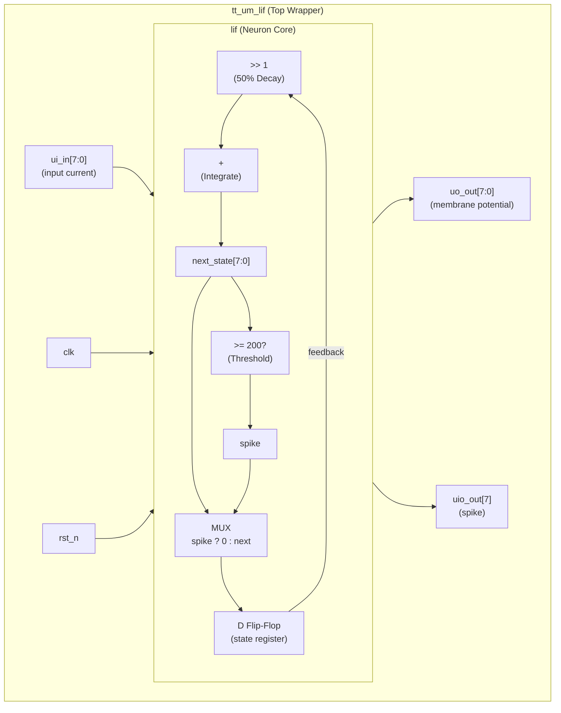

   

# Leaky Integrate-and-Fire Neuron — Tiny Tapeout

**Author:** Harshith Ravi Kopparam  
**Top Module:** `tt_um_lif`  
**Technology:** Verilog, Sky130 PDK (via Tiny Tapeout)  
**Tile Size:** 1×1 (~167 × 108 µm)

---

## 1. Overview

This project implements a **Leaky Integrate-and-Fire (LIF) neuron** in synthesizable Verilog, targeting fabrication through the [Tiny Tapeout](https://tinytapeout.com) program. The LIF model is the most widely used spiking-neuron abstraction in computational neuroscience and neuromorphic engineering. It captures the essential dynamics of biological neurons — passive membrane leak, synaptic current integration, and threshold-triggered spiking — in a minimal digital circuit.

### Why LIF?

| Property | Benefit |
|---|---|
| Simple arithmetic (shift + add) | Minimal area and power |
| Deterministic threshold behavior | Easy to verify and reason about |
| Spike-and-reset dynamics | Compatible with spike-coded neural networks |
| Fixed-point 8-bit datapath | Fits within a single Tiny Tapeout tile |

---

## 2. Architecture

The design consists of two Verilog modules:

| Module | Role |
|---|---|
| `tt_um_lif` | Top-level wrapper; maps Tiny Tapeout I/O to the LIF core |
| `lif` | Core neuron logic: leak, integrate, threshold, spike, and reset |

### 2.1 Block Diagram



**Data flow:** On every rising clock edge, the current membrane potential is decayed (right-shifted by 1), the input current is added, the result is compared against the threshold, and the state register is updated — either to `next_state` (no spike) or to `0` (spike reset).

### 2.2 Pinout

| Pin | Direction | Signal | Description |
|-----|-----------|--------|-------------|
| `ui[0]`–`ui[7]` | Input | `current[7:0]` | 8-bit unsigned input current |
| `uo[0]`–`uo[7]` | Output | `state[7:0]` | 8-bit membrane potential |
| `uio[7]` | Output | `spike` | High for one cycle when threshold is crossed |
| `uio[0]`–`uio[6]` | — | Unused | Directly driven low |
| `clk` | Input | Clock | Rising-edge triggered |
| `rst_n` | Input | Active-low reset | Asynchronous; clears membrane to 0 |
| `ena` | Input | Enable | Directly from Tiny Tapeout; tied but unused |

---

## 3. Design Details & Justifications

### 3.1 Leak Mechanism — Arithmetic Right Shift

```verilog
assign next_state = (state >> 1) + current;
```

The membrane potential decays by 50% each cycle via a **1-bit logical right shift**. This choice is intentional:

- **Zero-cost in hardware:** a right shift is simply a wire re-routing — no adders, no multipliers, no LUTs consumed.
- **Biologically motivated:** the LIF differential equation `dV/dt = -(V/τ) + I` becomes `V[n+1] = V[n]/2 + I[n]` when discretized with τ = 1 cycle. The `/2` maps directly to `>> 1`.
- **Decay constant trade-off:** a single-bit shift gives a leak factor of 0.5. A tunable leak would require a multiplier, which would not fit in a 1×1 tile.

### 3.2 Threshold and Spiking

```verilog
localparam [7:0] THRESHOLD = 8'd200;
assign spike = (next_state >= THRESHOLD);
```

The threshold is set to **200** (out of 255 max) as a `localparam`:

- **localparam over reg:** eliminates a flip-flop and prevents accidental runtime modification. The synthesizer can optimize the comparator against a known constant.
- **Value of 200:** chosen to leave headroom (55 values) above the threshold, ensuring that typical input currents (10–100) require multiple integration cycles before spiking — mirroring biologically realistic firing rates.

### 3.3 Spike-Triggered Reset

```verilog
state <= spike ? 8'd0 : next_state;
```

When a spike fires, the membrane potential resets to **0** on the next clock edge. This is essential for:

- **Refractory behavior:** prevents the neuron from remaining permanently saturated above threshold.
- **Repeated firing:** allows the neuron to spike rhythmically under sustained input, matching biological behavior.
- **Network compatibility:** downstream neurons in a spiking neural network (SNN) expect discrete spike events, not sustained high signals.

### 3.4 I/O Mapping (Top Wrapper)

```verilog
assign uio_oe  = 8'h80;  // Only bit 7 is output
assign uio_out = {spike_signal, 7'b0};
```

- **`uio_oe = 0x80`:** only bidirectional pin 7 is configured as an output (for the spike signal). Pins 0–6 remain inputs (pulled low), minimizing power and avoiding bus contention.
- **Spike on bit 7:** places the spike at the MSB of the bidirectional port, making it easy to probe with a logic analyzer (MSB-first convention).

---

## 4. Timing Diagram

The following diagram illustrates the neuron's behavior over 10 clock cycles with two input current levels.

```mermaid
---
displayMode: compact
---
gantt
    title LIF Neuron Timing — clk cycles 0–9
    dateFormat X
    axisFormat %s

    section clk
    ↑0 : 0, 1
    ↑1 : 1, 2
    ↑2 : 2, 3
    ↑3 : 3, 4
    ↑4 : 4, 5
    ↑5 : 5, 6
    ↑6 : 6, 7
    ↑7 : 7, 8
    ↑8 : 8, 9
    ↑9 : 9, 10

    section current
    0 (reset) : 0, 2
    20         : 2, 5
    150        : 5, 10

    section state
    0 (reset)  : 0, 2
    20         : 2, 3
    30         : 3, 4
    35         : 4, 5
    167        : 5, 6
    SPIKE→0    : crit, 6, 7
    150        : 7, 8
    SPIKE→0    : crit, 8, 9
    150        : 9, 10

    section spike
    LOW  : 0, 6
    HIGH : crit, 6, 7
    LOW  : 7, 8
    HIGH : crit, 8, 9
    LOW  : 9, 10
```



### Timing Walkthrough

| Cycle | current | state (before) | next = (state>>1)+current | spike? | state (after) |
|-------|---------|----------------|--------------------------|--------|---------------|
| 0–1 | 0 | 0 | — | — | 0 (reset held) |
| 2 | 20 | 0 | 0 + 20 = **20** | No | 20 |
| 3 | 20 | 20 | 10 + 20 = **30** | No | 30 |
| 4 | 20 | 30 | 15 + 20 = **35** | No | 35 |
| 5 | 150 | 35 | 17 + 150 = **167** | No | 167 |
| 6 | 150 | 167 | 83 + 150 = **233** | **Yes** (≥ 200) | **0** (reset) |
| 7 | 150 | 0 | 0 + 150 = **150** | No | 150 |
| 8 | 150 | 150 | 75 + 150 = **225** | **Yes** (≥ 200) | **0** (reset) |
| 9 | 150 | 0 | 0 + 150 = **150** | No | 150 |

**Key observations:**
- With `current = 20`, the membrane settles around 35–40 (leak balances input) — **no spike**.
- With `current = 150`, the neuron spikes **every 2 cycles** — demonstrating sustained rhythmic firing.
- After each spike, the membrane resets to 0, confirming the spike-reset mechanism works correctly.

---

## 5. Simulation & Testing

### 5.1 Test Framework

Tests use [cocotb](https://www.cocotb.org/) v2 with Icarus Verilog. The testbench (`test/tb.v`) instantiates `tt_um_lif` and exposes all Tiny Tapeout ports to the Python test harness.

### 5.2 Test Cases

| Test | Description | Stimulus | Expected | Verifies |
|------|-------------|----------|----------|----------|
| T1 | Single-cycle integration | `current=20`, 1 clk | `state=20`, no spike | Basic integration |
| T2 | Leak + integration | Hold `current=20`, 2nd clk | `state=30` (10+20) | Decay mechanism |
| T3 | Spike firing | `current=150`, ≤10 clks | Spike fires | Threshold crossing |
| T4 | Post-spike reset | `current=0` after spike | `state=0` | Membrane reset |

### 5.3 Running the Tests

```bash
# Inside the Docker container or CI environment:
cd test
make clean
make
```

Or locally with a Tiny Tapeout-compatible Docker image:

```bash
docker run --rm -v "$(pwd)":/workspace jeshragh/ece183-293 bash -c "cd /workspace/test && make"
```

### 5.4 CI/CD

Four GitHub Actions workflows run automatically on every push:

| Workflow | Purpose |
|----------|---------|
| **GDS** | Synthesizes the design through OpenLane → GDSII layout |
| **Docs** | Builds the project datasheet from `docs/info.md` |
| **Test** | Runs cocotb simulation (RTL + gate-level) |
| **FPGA** | Generates FPGA bitstream for prototyping |

---

## 6. Proposed Metrics

To evaluate the quality and efficiency of this LIF neuron implementation, the following metrics are proposed:

| Metric | How to Measure | Target |
|--------|---------------|--------|
| **Gate count / Area** | Post-synthesis report from OpenLane | Fit within 1×1 tile (~167×108 µm) |
| **Max clock frequency** | Static timing analysis (STA) | ≥ 200 Hz (specified `clock_hz`) |
| **Power per spike** | Gate-level power estimation (switching activity) | Minimize dynamic power |
| **Spike timing accuracy** | Compare RTL simulation vs. hand-calculated cycle-accurate values | 100% match (deterministic design) |
| **Leak fidelity** | Measure steady-state membrane for known constant input | `V_ss = current / (1 - 0.5)` = `2 × current` |

---

## 7. Resources

- [Tiny Tapeout](https://tinytapeout.com) — educational chip fabrication program
- [Project Datasheet](docs/info.md) — detailed how-it-works and test instructions
- [Cocotb Documentation](https://docs.cocotb.org/) — Python-based hardware verification
- [OpenLane](https://github.com/The-OpenROAD-Project/OpenLane) — open-source RTL-to-GDSII flow
- [Izhikevich (2003)](https://www.izhikevich.org/publications/spikes.htm) — comparison of spiking neuron models
